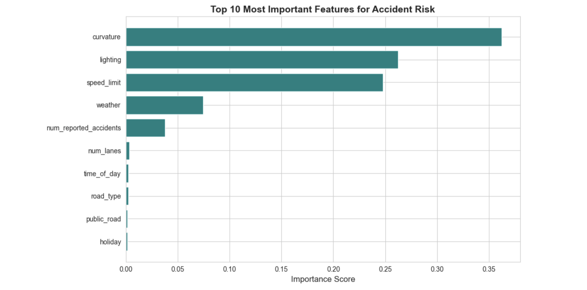
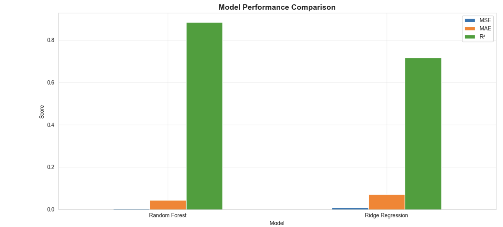
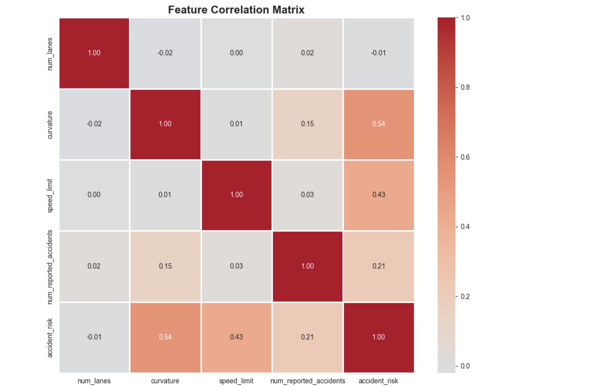

# 🚗 Road Accident Risk Predictor

[](https://www.python.org/)
[](https://streamlit.io/)
[](https://scikit-learn.org/)
[](LICENSE)
[](https://github.com/roshanaryal1/Predicting-Road-Accident-Risk/stargazers)

> An AI-powered web application built with Streamlit that predicts road accident risk probability using environmental and road condition features. This project was originally developed for the Kaggle Playground Series (S5E10).

---

## 🚀 Live Demo

The application is deployed and publicly accessible on Streamlit Community Cloud.

**[➡️ Try the Live Application Here](https://roadaccident-roshanar-aryal.streamlit.app/)**


---

## ✨ Features

-   **🔮 Real-time Risk Prediction**: Instantly assess accident risk by inputting road, weather, and traffic conditions.
-   **📊 Interactive Gauge Chart**: Visualize the predicted risk probability on a color-coded gauge for immediate understanding.
-   **💡 AI-Powered Recommendations**: Receive dynamic, context-aware safety tips based on the provided conditions to help mitigate risks.
-   **📈 Model Insights**: Explore the Random Forest model's performance metrics and the most influential features driving its predictions.
-   **🎨 Professional UI**: A modern, responsive, and visually appealing "glassmorphism" interface built for a superior user experience.
-   **☁️ Auto-Training on Deploy**: The app automatically trains the ML model on the cloud server if it's not already present, a clever workaround for deployment constraints on large model files.

---

## 🛠️ Tech Stack

-   **Web Framework**: [Streamlit](https://streamlit.io/)
-   **Machine Learning**: [Scikit-learn](https://scikit-learn.org/) (using `RandomForestRegressor`)
-   **Data Manipulation**: [Pandas](https://pandas.pydata.org/), [NumPy](https://numpy.org/)
-   **Visualization**: [Plotly](https://plotly.com/)
-   **Deployment**: [Streamlit Community Cloud](https://streamlit.io/cloud)
-   **Version Control**: Git & GitHub

---

## 📊 Data Analysis & Visualizations

The model's predictions are driven by key insights derived from the data. Here are some of the visualizations from the analysis phase:

### Feature Importance
This chart shows which factors have the most impact on the model's predictions. `num_reported_accidents` and `curvature` are clearly the most significant predictors.



### Model Comparison
Different models were evaluated, with Random Forest providing the best performance for this regression task.



### Correlation Matrix
This matrix helps visualize the relationships between different features in the dataset.



---

## 📁 Project Structure

The repository is organized to support both local development and cloud deployment of the Streamlit application.

```
road-accident-risk-predictor/
│
├── streamlit_app.py                # 🚀 Main Streamlit application logic
├── train_and_save_model.py         # 🤖 Script to train and save the ML model
│
├── data/                           # 📁 Raw training and test data from Kaggle
│   ├── train.csv
│   └── test.csv
│
├── images/                         # 📸 Visualizations for the README
│   ├── correlation_matrix.png
│   ├── feature_importance.png
│   └── model_comparison.png
│
├── model/                          # 💾 Saved model artifacts (generated on run)
│   ├── accident_risk_model.pkl
│   └── label_encoders.pkl
│
├── .python-version                 # 🐍 Specifies Python version (3.11) for deployment
├── requirements.txt                # Python dependencies for local development
├── streamlit_requirements.txt      # Dependencies for Streamlit Cloud
├── packages.txt                    # System-level packages for Streamlit Cloud
├── README.md                       # This file
└── .gitignore                      # Specifies files for Git to ignore
```

---

## 🚀 Quick Start (Local Development)

Follow these steps to run the application on your local machine.

### 1. Prerequisites
-   Python 3.11+
-   `pip` package manager

### 2. Clone the Repository
```bash
git clone https://github.com/roshanaryal1/Predicting-Road-Accident-Risk.git
cd Predicting-Road-Accident-Risk
```

### 3. Set up a Virtual Environment
Using a virtual environment is a best practice for managing project-specific dependencies.
```bash
# Create a virtual environment
python3 -m venv venv

# Activate it
# On macOS/Linux:
source venv/bin/activate
# On Windows:
venv\Scripts\activate
```

### 4. Install Dependencies
Install all the required Python packages.
```bash
pip install -r requirements.txt
```

### 5. Run the Model Training Script
The Streamlit app requires the model files to be present. Run the training script first to generate them locally.
```bash
python3 train_and_save_model.py
```
This will create the `model/` directory containing `accident_risk_model.pkl` and `label_encoders.pkl`.

### 6. Launch the Streamlit App
You're all set! Launch the application.
```bash
streamlit run streamlit_app.py
```
✅ The application should now be running in your default web browser.

---

## 👤 Author

**Roshan Aryal**

-   **GitHub**: [@roshanaryal1](https://github.com/roshanaryal1)
-   **LinkedIn**: [roshanaryaal](https://www.linkedin.com/in/roshanaryaal/)
-   **Portfolio**: [roshanaryal.com](https://www.roshanaryal.com)

---

## 📝 License

This project is licensed under the MIT License. See the `LICENSE` file for more details.
