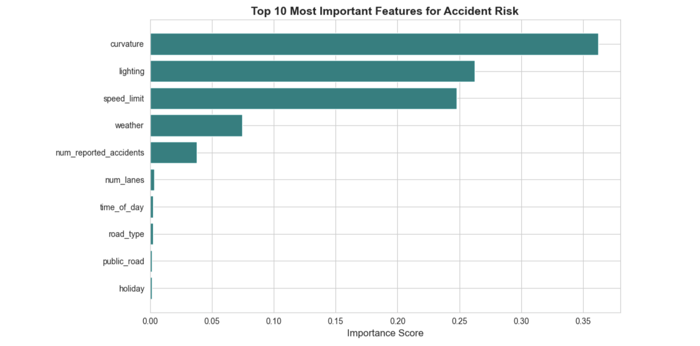
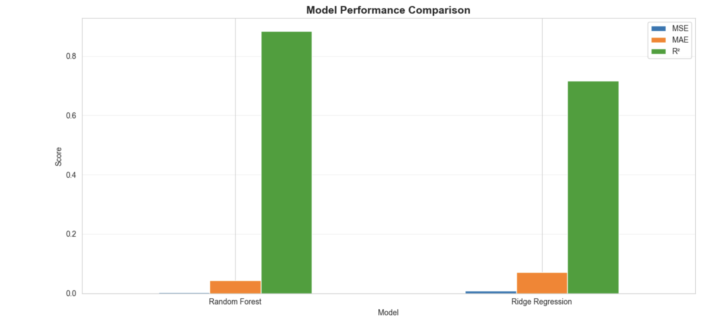
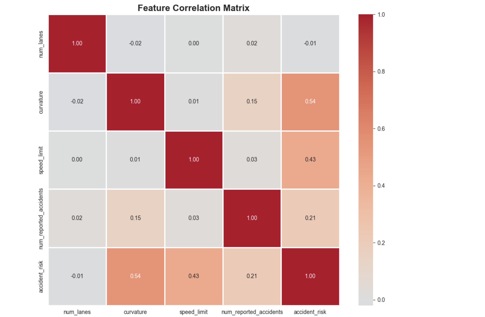

# 🚗 **Road Accident Risk Predictor**

[](https://www.python.org/)
[](https://streamlit.io/)
[](https://scikit-learn.org/)
[](LICENSE)
[](https://github.com/roshanaryal1/Predicting-Road-Accident-Risk/stargazers)

> 🧠 An AI-powered web app that predicts **road accident risk probability** using environmental and road condition data.  
> Originally developed for the **Kaggle Playground Series (S5E10)**.

---

## 🌐 **Live Demo**

🚀 **[Try the Live Application Here →](https://roadaccident-roshanar-aryal.streamlit.app/)**  
*(Hosted on Streamlit Community Cloud)*


---

## ✨ **Key Features**

✅ **Real-Time Prediction** — Instantly assess accident risk using real-world parameters.  
📊 **Interactive Gauge Chart** — Color-coded risk meter for visual clarity.  
💡 **AI Safety Recommendations** — Context-aware safety tips for each prediction.  
📈 **Model Insights** — Explore top features influencing the Random Forest model.  
🎨 **Modern Glass UI** — Sleek, responsive design for a smooth user experience.  
☁️ **Auto Model Training** — Automatically trains the ML model in the cloud on deploy.

---

## 🧰 **Tech Stack**

| Category | Technology |
|-----------|-------------|
| **Web Framework** | [Streamlit](https://streamlit.io/) |
| **Machine Learning** | [Scikit-learn](https://scikit-learn.org/) |
| **Data Processing** | [Pandas](https://pandas.pydata.org/), [NumPy](https://numpy.org/) |
| **Visualization** | [Plotly](https://plotly.com/) |
| **Deployment** | [Streamlit Cloud](https://streamlit.io/cloud) |
| **Version Control** | Git & GitHub |

---

## 🧮 **How It Works**

The app uses a **Random Forest Regressor** to estimate the probability of a road accident based on multiple factors.  
Each feature plays a role in shaping the final risk score:

| Feature | Description | Influence |
|----------|--------------|------------|
| **Num Reported Accidents** | Past accident frequency on similar roads | 🚨 Higher = Stronger risk |
| **Curvature** | Sharpness of the road’s turns | 🌀 Higher = More chance of accidents |
| **Lighting Conditions** | Level of road illumination | 🌙 Poor lighting = Increased risk |
| **Weather** | Rain, fog, or clear skies | 🌧️ Rain/Fog = Higher risk |
| **Traffic Volume** | Estimated vehicles per hour | 🚗 Higher = More exposure |

The prediction is displayed through a **gauge chart**, along with **AI-generated recommendations** such as  
> “Avoid sharp curves in low lighting conditions.”

---

## 📊 **Data Insights & Visualizations**

### 🔍 Feature Importance
Shows which factors have the greatest impact on predictions.  
`num_reported_accidents` and `curvature` are top contributors.



### 🧠 Model Comparison
Multiple models were tested; **Random Forest** delivered the best results.



### 🔗 Correlation Matrix
Visualizes the relationships between key features.



---

## 📂 **Project Structure**

```

road-accident-risk-predictor/
│
├── streamlit_app.py              # 🚀 Main Streamlit application
├── train_and_save_model.py       # 🤖 ML model training script
│
├── data/                         # 📁 Raw training & test data
│   ├── train.csv
│   └── test.csv
│
├── images/                       # 📸 Visualizations for README
│   ├── correlation_matrix.png
│   ├── feature_importance.png
│   └── model_comparison.png
│
├── model/                        # 💾 Trained model artifacts
│   ├── accident_risk_model.pkl
│   └── label_encoders.pkl
│
├── .python-version               # 🐍 Python version (3.11)
├── requirements.txt              # Package dependencies
├── streamlit_requirements.txt    # Streamlit Cloud dependencies
├── packages.txt                  # System-level dependencies
├── README.md                     # Project documentation
└── .gitignore                    # Ignore unnecessary files

````

---

## ⚙️ **Quick Start (Local Setup)**

### 1️⃣ Prerequisites
- Python 3.11+
- pip (Python package manager)

### 2️⃣ Clone the Repository
```bash
git clone https://github.com/roshanaryal1/Predicting-Road-Accident-Risk.git
cd Predicting-Road-Accident-Risk
````

### 3️⃣ Create a Virtual Environment

```bash
python3 -m venv venv
source venv/bin/activate     # macOS/Linux
venv\Scripts\activate        # Windows
```

### 4️⃣ Install Dependencies

```bash
pip install -r requirements.txt
```

### 5️⃣ Train the Model

```bash
python3 train_and_save_model.py
```

This generates:

```
model/
 ├── accident_risk_model.pkl
 └── label_encoders.pkl
```

### 6️⃣ Launch the App

```bash
streamlit run streamlit_app.py
```

🎉 The app will open automatically in your default browser.

---

## 👨‍💻 **Author**

**Roshan Aryal**

* 🌐 [roshanaryal.com](https://www.roshanaryal.com)
* 💼 [LinkedIn](https://www.linkedin.com/in/roshanaryaal/)
* 💻 [GitHub](https://github.com/roshanaryal1)

---

## 📜 **License**

This project is licensed under the **MIT License**.
See the [LICENSE](LICENSE) file for full details.

---

⭐ **If you like this project, don’t forget to give it a star on GitHub!**
Your support helps improve open-source AI projects like this one 🚀

```

---

Would you like me to:
- Add a **“Contributing”** section (for open-source collaboration), or  
- Add a **badges row with model accuracy and dataset size** (for a more research-style README)?
```
